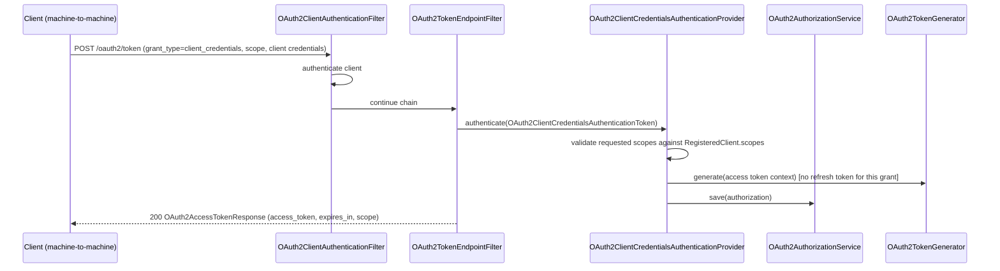
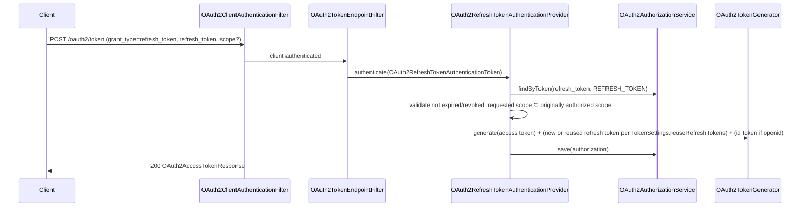
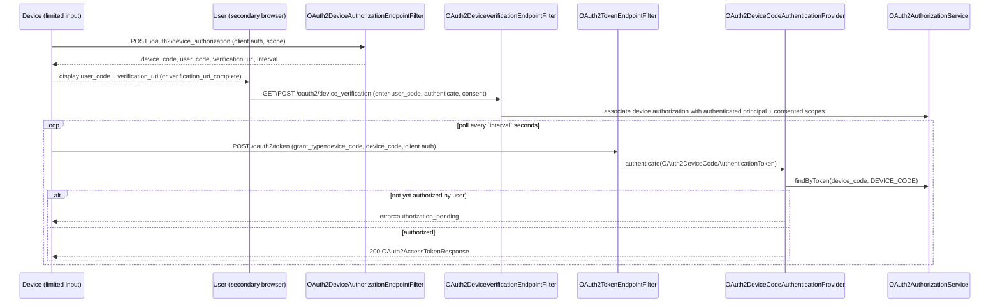
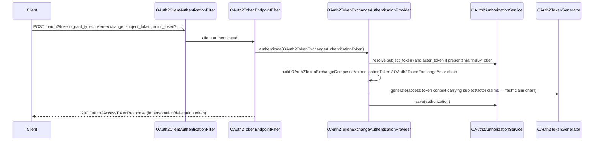
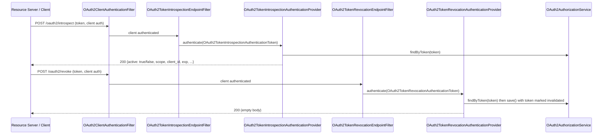
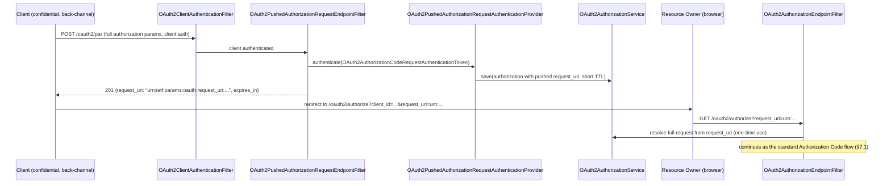
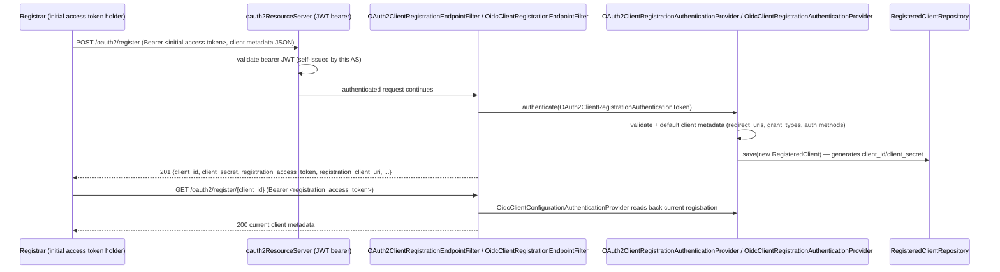
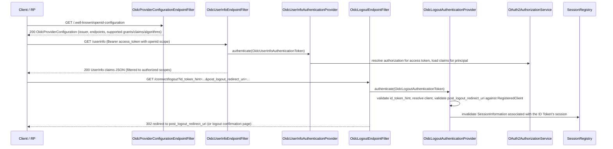
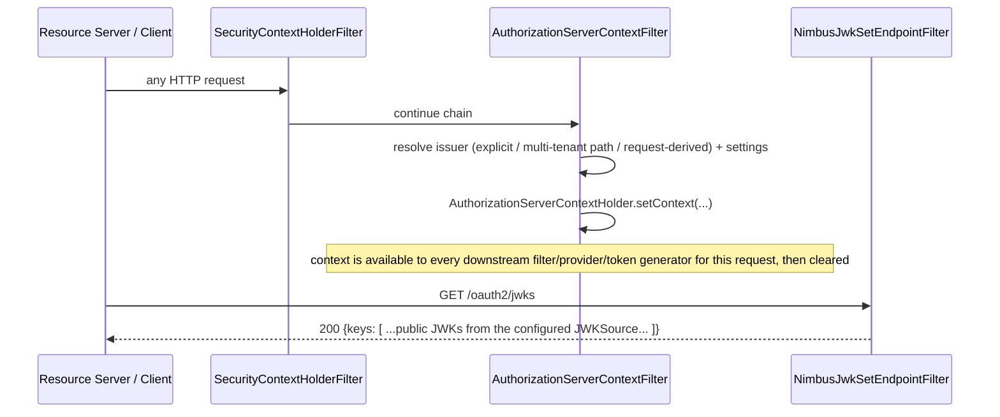

# OAuth2 Authorization Server — Architecture and Workflow

This document describes the internal architecture of the `oauth2-authorization-server` module and how it cooperates
with the Java configuration classes in the `config` module (package
`org.springframework.security.config.annotation.web.configurers.oauth2.server.authorization`) to implement an
OAuth 2.1 / OpenID Connect 1.0 Authorization Server on top of Spring Security's `HttpSecurity` filter chain.

## 1. Scope and standards implemented

| Capability | Specification |
|---|---|
| Authorization Code Grant (+ PKCE) | RFC 6749, RFC 7636 |
| Client Credentials Grant | RFC 6749 |
| Refresh Token Grant | RFC 6749 |
| Device Authorization Grant | RFC 8628 |
| Token Exchange Grant | RFC 8693 |
| Pushed Authorization Requests (PAR) | RFC 9126 |
| Token Introspection | RFC 7662 |
| Token Revocation | RFC 7009 |
| Client Authentication (`client_secret_basic`, `client_secret_post`, `private_key_jwt`, `client_secret_jwt`, `none`, `tls_client_auth`, `self_signed_tls_client_auth`) | RFC 6749, RFC 7523, RFC 8705 |
| Dynamic Client Registration | RFC 7591 / RFC 7592, OpenID Connect Dynamic Client Registration 1.0 |
| Authorization Server Metadata | RFC 8414 |
| JWK Set | RFC 7517 |
| DPoP-bound access tokens | RFC 9449 |
| OpenID Connect Core (ID Token, UserInfo) | OIDC Core 1.0 |
| OpenID Connect Discovery | OIDC Discovery 1.0 |
| RP-Initiated Logout | OIDC RP-Initiated Logout 1.0 |

The implementation targets **OAuth 2.1**: PKCE is required by default for the authorization code grant
(`ClientSettings.isRequireProofKey() == true`), and the implicit and resource-owner-password-credentials grants are
not implemented.

## 2. Module split

The feature is split across two modules:

- **`oauth2/oauth2-authorization-server`** — protocol-level domain and runtime: the OAuth2/OIDC domain model
  (`RegisteredClient`, `OAuth2Authorization`, settings), `AuthenticationProvider`/`AuthenticationToken`
  implementations for every grant type and endpoint, the servlet `Filter`s that expose each endpoint, and the token
  generation SPI. This module has **no dependency on the Spring Security configuration DSL** — it can be wired up
  manually without `HttpSecurity`.
- **`config`** (package `...configurers.oauth2.server.authorization`) — the `HttpSecurity` DSL
  (`OAuth2AuthorizationServerConfigurer` and its per-endpoint sub-configurers) that assembles the pieces above into
  a `SecurityFilterChain`. This is the module applications actually use via
  `httpSecurity.with(OAuth2AuthorizationServerConfigurer.authorizationServer(), Customizer.withDefaults())` (or the
  equivalent `.with()`/`.apply()` style depending on Spring Security version).

```
config module                                    oauth2-authorization-server module
------------------------------------------------  --------------------------------------------------
OAuth2AuthorizationServerConfigurer  ─────wires───▶ RegisteredClientRepository
 ├─ OAuth2ClientAuthenticationConfigurer            OAuth2AuthorizationService
 ├─ OAuth2AuthorizationServerMetadataEndpointConf.   OAuth2AuthorizationConsentService
 ├─ OAuth2AuthorizationEndpointConfigurer            AuthorizationServerSettings / ClientSettings / TokenSettings
 ├─ OAuth2PushedAuthorizationRequestEndpointConf.    OAuth2TokenGenerator (JwtGenerator, AccessToken/RefreshToken gen)
 ├─ OAuth2TokenEndpointConfigurer                    AuthenticationProvider(s) per grant/endpoint
 ├─ OAuth2TokenIntrospectionEndpointConfigurer       AuthenticationToken(s) per grant/endpoint
 ├─ OAuth2TokenRevocationEndpointConfigurer          AuthenticationConverter(s) per endpoint
 ├─ OAuth2DeviceAuthorizationEndpointConfigurer      Filter(s) per endpoint
 ├─ OAuth2DeviceVerificationEndpointConfigurer
 ├─ OAuth2ClientRegistrationEndpointConfigurer
 └─ OidcConfigurer
     ├─ OidcProviderConfigurationEndpointConfigurer
     ├─ OidcLogoutEndpointConfigurer
     ├─ OidcClientRegistrationEndpointConfigurer
     └─ OidcUserInfoEndpointConfigurer
```

### 2.1 Package map (`oauth2-authorization-server`)

| Package | Responsibility |
|---|---|
| `...authorization` (root) | Domain model: `RegisteredClient`-independent constructs — `OAuth2Authorization`, `OAuth2AuthorizationConsent`, `OAuth2AuthorizationService`/`InMemory`/`Jdbc` impls, `OAuth2AuthorizationConsentService`/impls, `OAuth2AuthorizationServerMetadata`, `OAuth2ClientRegistration`, `OAuth2TokenIntrospection`, `OAuth2TokenType` |
| `...authorization.client` | `RegisteredClient`, `RegisteredClientRepository` and `InMemory`/`Jdbc` implementations |
| `...authorization.settings` | `AuthorizationServerSettings`, `ClientSettings`, `TokenSettings`, `OAuth2TokenFormat`, `AbstractSettings` |
| `...authorization.context` | `AuthorizationServerContext`, `AuthorizationServerContextHolder` (thread-bound, like `SecurityContextHolder`) |
| `...authorization.authentication` | `AuthenticationToken` + `AuthenticationProvider` pairs for every grant type / protocol interaction (authorization code, refresh token, client credentials, device code, token exchange, client authentication methods, introspection, revocation, PAR, dynamic client registration, consent) |
| `...authorization.token` | The token-generation SPI: `OAuth2TokenContext`, `OAuth2TokenGenerator`, `DelegatingOAuth2TokenGenerator`, `JwtGenerator`, `OAuth2AccessTokenGenerator`, `OAuth2RefreshTokenGenerator`, `OAuth2TokenCustomizer`, `JwtEncodingContext` |
| `...authorization.web` | Servlet `Filter`s for each protocol endpoint (`OAuth2AuthorizationEndpointFilter`, `OAuth2TokenEndpointFilter`, `OAuth2ClientAuthenticationFilter`, `NimbusJwkSetEndpointFilter`, etc.) |
| `...authorization.web.authentication` | `AuthenticationConverter`s that translate `HttpServletRequest` → `AuthenticationToken`, plus success/failure handlers |
| `...authorization.oidc` | OIDC-specific domain model (`OidcClientRegistration`, `OidcProviderConfiguration`) and, in sub-packages `authentication`/`converter`/`web`/`http.converter`, the OIDC UserInfo, RP-Initiated Logout, Dynamic Client Registration, and Discovery endpoints |
| `...authorization.aot` | GraalVM native-image hints (reflection/serialization registration) |

## 3. Configuration model — `OAuth2AuthorizationServerConfigurer`

`OAuth2AuthorizationServerConfigurer` is an `AbstractHttpConfigurer<OAuth2AuthorizationServerConfigurer, HttpSecurity>`.
It does not implement protocol logic itself; it is a **facade that owns a `Map` of per-endpoint sub-configurers**
(`configurers: Map<Class<? extends AbstractOAuth2Configurer>, AbstractOAuth2Configurer>`) and delegates `init()`/
`configure()` to each of them in `LinkedHashMap` (insertion) order.

Sub-configurers extend the package-private `AbstractOAuth2Configurer`, which defines the contract:

```java
abstract void init(HttpSecurity httpSecurity);
abstract void configure(HttpSecurity httpSecurity);
abstract RequestMatcher getRequestMatcher();
```

Four configurers are **always present** (registered eagerly in `createConfigurers()`):
`OAuth2ClientAuthenticationConfigurer`, `OAuth2AuthorizationServerMetadataEndpointConfigurer`,
`OAuth2AuthorizationEndpointConfigurer`, `OAuth2TokenEndpointConfigurer`,
`OAuth2TokenIntrospectionEndpointConfigurer`, `OAuth2TokenRevocationEndpointConfigurer`.

The rest are **opt-in and lazily instantiated** the first time their corresponding DSL method is called:
`pushedAuthorizationRequestEndpoint(...)`, `deviceAuthorizationEndpoint(...)`/`deviceVerificationEndpoint(...)`
(these two enable each other, since one is useless without the other), `clientRegistrationEndpoint(...)`, and
`oidc(...)` (which itself lazily creates `OidcClientRegistrationEndpointConfigurer` on demand, while
`OidcProviderConfigurationEndpointConfigurer`, `OidcLogoutEndpointConfigurer`, `OidcUserInfoEndpointConfigurer` are
eagerly created as soon as `OidcConfigurer` itself is created).

### 3.1 Shared objects

Callers customize collaborators by calling `HttpSecurity.setSharedObject(...)` through dedicated builder methods on
`OAuth2AuthorizationServerConfigurer`: `registeredClientRepository(...)`, `authorizationService(...)`,
`authorizationConsentService(...)`, `authorizationServerSettings(...)`, `tokenGenerator(...)`. Internally,
`OAuth2ConfigurerUtils` resolves each collaborator with a **shared-object-first, then-bean, then-default** lookup
strategy:

1. Return the `HttpSecurity` shared object if already set.
2. Otherwise look up a unique bean of the required type from the `ApplicationContext`.
3. Otherwise fall back to a sensible default (`InMemoryOAuth2AuthorizationService`,
   `InMemoryOAuth2AuthorizationConsentService`), or build one from other collaborators
   (`DelegatingOAuth2TokenGenerator` composed from `JwtGenerator` + `OAuth2AccessTokenGenerator` +
   `OAuth2RefreshTokenGenerator`, itself built from a `JwtEncoder`/`JWKSource` bean if present).

The resolved instance is cached back onto the shared-object map so every sub-configurer observes the same instance.

### 3.2 `init()` lifecycle

`OAuth2AuthorizationServerConfigurer.init(HttpSecurity)` runs in this order:

1. Resolve and validate `AuthorizationServerSettings` (issuer, if set, must be a valid URL without query/fragment
   per RFC 8414 §2).
2. If OIDC is enabled (`OidcConfigurer` present): create a `SessionRegistry` (used to correlate a browser session
   with issued ID Tokens for RP-Initiated Logout / `sid` claim) and register a session-authentication callback on
   the authorization endpoint configurer.
   If OIDC is **not** enabled: register an `OAuth2AuthorizationCodeRequestAuthenticationValidator` on both the
   authorization endpoint and (if present) the PAR endpoint that rejects any request containing the `openid` scope
   with `invalid_scope`.
3. Call `init(httpSecurity)` on every registered sub-configurer, collecting each one's `RequestMatcher` into the
   aggregate `endpointsMatcher` (plus the JWK Set endpoint, which has no dedicated sub-configurer).
4. If an `ExceptionHandlingConfigurer` is present, register `HttpStatusEntryPoint(401)` as the
   `defaultAuthenticationEntryPointFor` the token/introspection/revocation/device-authorization/PAR endpoints (these
   are machine-to-machine endpoints — no redirect-to-login makes sense there, unlike the authorization endpoint).
5. Disable CSRF for all authorization-server endpoints (`csrf().ignoringRequestMatchers(endpointsMatcher)`) — these
   endpoints are protected by OAuth2 client authentication / bearer tokens instead.
6. If Dynamic Client Registration and/or OIDC UserInfo/Client Registration are enabled, enable
   `oauth2ResourceServer().jwt(...)` on the same `HttpSecurity` so that access tokens issued by this same server can
   be presented as bearer tokens back to it (self-issued-token-as-resource-server pattern).

Each endpoint sub-configurer's own `init()` typically: computes its endpoint URI(s) from
`AuthorizationServerSettings` (honoring `isMultipleIssuersAllowed()`, which prefixes the path with `/**` to support
path-based multi-tenant issuers), builds its list of default `AuthenticationProvider`s, merges in any
user-supplied providers (prepended, so custom providers get first refusal — see §6.1), and registers each with
`httpSecurity.authenticationProvider(...)` so they all participate in the shared `AuthenticationManager`.

### 3.3 `configure()` lifecycle

`OAuth2AuthorizationServerConfigurer.configure(HttpSecurity)` runs in this order:

1. Cross-wires default metadata: if Dynamic Client Registration / Device Authorization / PAR are enabled, register
   `addDefaultAuthorizationServerMetadataCustomizer(...)` callbacks on
   `OAuth2AuthorizationServerMetadataEndpointConfigurer` (and, symmetrically, on
   `OidcProviderConfigurationEndpointConfigurer` from `OidcConfigurer.configure()`) so the corresponding endpoint
   URLs and grant types are advertised in `/.well-known/oauth-authorization-server` and
   `/.well-known/openid-configuration` automatically.
2. Call `configure(httpSecurity)` on every sub-configurer — this is where each one builds and installs its `Filter`.
3. Install the `AuthorizationServerContextFilter` **after `SecurityContextHolderFilter`** — this populates
   `AuthorizationServerContextHolder` (a `ThreadLocal`, mirroring `SecurityContextHolder`) with the current
   `AuthorizationServerContext` (resolved issuer + `AuthorizationServerSettings`) for the duration of the request,
   for every request (not just authorization-server endpoints).
4. If a `JWKSource` bean is available, install `NimbusJwkSetEndpointFilter` **before**
   `AbstractPreAuthenticatedProcessingFilter` to serve the JWK Set endpoint.

### 3.4 Filter chain positions

All authorization-server filters are anchored relative to two well-known Spring Security filters,
`AbstractPreAuthenticatedProcessingFilter` and `AuthorizationFilter`, plus `SecurityContextHolderFilter` and
`LogoutFilter`:

| Filter | Anchor | Endpoint(s) |
|---|---|---|
| `AuthorizationServerContextFilter` | after `SecurityContextHolderFilter` | (all requests — populates context) |
| `NimbusJwkSetEndpointFilter` | before `AbstractPreAuthenticatedProcessingFilter` | `GET /oauth2/jwks` |
| `OidcProviderConfigurationEndpointFilter` | before `AbstractPreAuthenticatedProcessingFilter` | `GET /.well-known/openid-configuration` |
| `OAuth2AuthorizationServerMetadataEndpointFilter` | before `AbstractPreAuthenticatedProcessingFilter` | `GET /.well-known/oauth-authorization-server` |
| `OAuth2ClientAuthenticationFilter` | after `AbstractPreAuthenticatedProcessingFilter` | client-authenticated endpoints (token, introspection, revocation, device authorization, PAR) |
| `OidcLogoutEndpointFilter` | before `LogoutFilter` | `GET/POST /connect/logout` |
| `OAuth2AuthorizationEndpointFilter` | after `AuthorizationFilter` | `GET/POST /oauth2/authorize` |
| `OAuth2TokenEndpointFilter` | after `AuthorizationFilter` | `POST /oauth2/token` |
| `OAuth2TokenIntrospectionEndpointFilter` | after `AuthorizationFilter` | `POST /oauth2/introspect` |
| `OAuth2TokenRevocationEndpointFilter` | after `AuthorizationFilter` | `POST /oauth2/revoke` |
| `OAuth2DeviceAuthorizationEndpointFilter` | after `AuthorizationFilter` | `POST /oauth2/device_authorization` |
| `OAuth2DeviceVerificationEndpointFilter` | after `AuthorizationFilter` | `GET/POST /oauth2/device_verification` |
| `OAuth2PushedAuthorizationRequestEndpointFilter` | after `AuthorizationFilter` | `POST /oauth2/par` |
| `OAuth2ClientRegistrationEndpointFilter` | after `AuthorizationFilter` | `POST/GET/PUT/DELETE /oauth2/register/**` |
| `OidcClientRegistrationEndpointFilter` | after `AuthorizationFilter` | `POST/GET/PUT/DELETE /connect/register/**` |
| `OidcUserInfoEndpointFilter` | after `AuthorizationFilter` | `GET/POST /userinfo` |

The `OAuth2AuthorizationEndpointConfigurer` additionally installs a second, internal filter *before* its own
endpoint filter (`addFilterBefore(authorizationCodeRequestValidatingFilter, OAuth2AuthorizationEndpointFilter.class)`)
that runs registered `OAuth2AuthorizationCodeRequestAuthenticationValidator`s (this is the hook used in §3.2 step 2
to reject `openid` scope when OIDC is disabled).

## 4. Core domain model

### 4.1 `RegisteredClient`

`RegisteredClient` (package `...authorization.client`) is the durable client registration record: `id`, `clientId`
(+ `clientIdIssuedAt`), `clientSecret` (+ `clientSecretExpiresAt`), `clientName`, a `Set<ClientAuthenticationMethod>`,
a `Set<AuthorizationGrantType>`, `redirectUris`, `postLogoutRedirectUris`, `scopes`, and two nested settings objects:
`ClientSettings` and `TokenSettings`. It is immutable and built via `RegisteredClient.withId(...)` /
`RegisteredClient.from(existing)` builders.

`RegisteredClientRepository` is the single-method lookup SPI (`findById`, `findByClientId`). Two implementations
ship out of the box:

- `InMemoryRegisteredClientRepository` — backed by a `Map`, suitable for tests/demos.
- `JdbcRegisteredClientRepository` — backed by `JdbcOperations` + `RowMapper`/`RowMapper`-pair, using the schema in
  `oauth2-registered-client-schema.sql` (table `oauth2_registered_client`). Client settings and token settings are
  persisted as JSON via a pluggable `Function<Map<String, Object>, String>` serializer (Jackson-based by default,
  registered via the module's `jackson2` sub-package `ObjectMapper` mixins).

### 4.2 `OAuth2Authorization` / `OAuth2AuthorizationConsent`

`OAuth2Authorization` (root `...authorization` package) is the *runtime* record of a granted authorization: the
`registeredClientId`, `principalName`, `authorizationGrantType`, `authorizedScopes`, an extensible
`Map<Class<? extends OAuth2Token>, Token<?>>` holding every token issued for this authorization (authorization
code, access token, refresh token, ID token, OIDC/OAuth2 metadata such as the original `OAuth2AuthorizationRequest`,
device code/user code, etc.), and a free-form `attributes` map. It is looked up by `OAuth2AuthorizationService`
using several query strategies (`findById`, `findByToken(token, tokenType)`), because different endpoints have
only the authorization code, or only the access/refresh token, or only the device/user code, at hand.

`OAuth2AuthorizationConsentService`/`OAuth2AuthorizationConsent` record which scopes a principal has already
consented to for a given client, so a repeat authorization request (when `ClientSettings.isRequireAuthorizationConsent()`
is `true`) can skip the consent page for previously-approved scopes.

Both services have `InMemory*` and `Jdbc*` implementations, the latter backed by
`oauth2-authorization-schema.sql` / `oauth2-authorization-consent-schema.sql`.

### 4.3 Settings objects

All three settings classes extend `AbstractSettings`, a `Map<String, Object>`-backed value holder with a
`Builder`/`AbstractBuilder` pattern (`setting(key, value)`); this keeps them forward-compatible (new settings can be
added without breaking serialization) and JSON-serializable for JDBC persistence.

| Class | Governs | Notable defaults |
|---|---|---|
| `AuthorizationServerSettings` | Server-wide endpoint URIs + issuer | endpoints default to `/oauth2/...`, `/connect/...`, `/userinfo`; `multipleIssuersAllowed=false` |
| `ClientSettings` | Per-client behavior | `requireProofKey=true` (PKCE mandatory — OAuth 2.1), `requireAuthorizationConsent=false` |
| `TokenSettings` | Per-client token lifetimes/format | `authorizationCodeTimeToLive=5m`, `accessTokenTimeToLive=5m`, `accessTokenFormat=SELF_CONTAINED`, `deviceCodeTimeToLive=5m`, `reuseRefreshTokens=true`, `refreshTokenTimeToLive=60m`, `idTokenSignatureAlgorithm=RS256` |

`OAuth2TokenFormat` is a two-value enum: `SELF_CONTAINED` (JWT access token) or `REFERENCE` (opaque access token,
looked up via introspection/the `OAuth2AuthorizationService` rather than self-verified) — see §5.

### 4.4 `AuthorizationServerContext`

`AuthorizationServerContext` bundles the **resolved issuer identifier** for the current request together with the
`AuthorizationServerSettings`. Resolution logic (in `AuthorizationServerContextFilter`) is:

- If `authorizationServerSettings.getIssuer()` is explicitly configured → always use it (single-tenant).
- Else if `isMultipleIssuersAllowed()` → derive the issuer from the current request's scheme/host/port + any path
  prefix preceding the matched authorization-server endpoint (multi-tenant hosting, one issuer per path segment).
- Else → derive from the request's scheme/host/port with no path (single-tenant, implicit issuer).

`AuthorizationServerContextHolder.getContext()` exposes this via a `ThreadLocal` to any code running within the
request (token generators, metadata endpoint customizers, etc.), analogous to `SecurityContextHolder`.

## 5. Token generation pipeline

Every place that needs to mint a token (authorization code, access token, refresh token, ID token, device code)
goes through the same abstraction:

```
OAuth2TokenContext  ──▶  OAuth2TokenGenerator<T extends OAuth2Token>.generate(context) : T | null
```

`OAuth2TokenContext` (built via nested `AbstractBuilder`) carries the `RegisteredClient`, the resource-owner/client
`principal`, the `AuthorizationServerContext`, the authorized scopes, the `OAuth2TokenType`, the
`AuthorizationGrantType`, the grant `Authentication`, and (for refresh/consent flows) the current `OAuth2Authorization`.

`OAuth2ConfigurerUtils.getTokenGenerator(HttpSecurity)` builds the default generator, a
**`DelegatingOAuth2TokenGenerator`** — a simple chain-of-responsibility that calls each delegate's `generate(context)`
in order and returns the first non-null result:

```
DelegatingOAuth2TokenGenerator
 ├─ JwtGenerator                 (only if a JwtEncoder/JWKSource is available)
 ├─ OAuth2AccessTokenGenerator   (handles "reference"/opaque access tokens, and any token JwtGenerator declined)
 └─ OAuth2RefreshTokenGenerator
```

- **`JwtGenerator`** produces a `Jwt` for `OAuth2TokenType.ACCESS_TOKEN` (only when
  `RegisteredClient.getTokenSettings().getAccessTokenFormat() == SELF_CONTAINED`) or for the OIDC ID Token
  (`tokenType.getValue().equals("id_token")`, unconditionally — ID Tokens are always JWTs). It sets standard claims
  (`iss`, `sub`, `aud`, `iat`, `exp`, `jti`, `nbf`+`scope` for access tokens; `azp`, `nonce`, `sid`, `auth_time` for
  ID tokens depending on grant type), then — if a `jwtCustomizer` is set — builds a `JwtEncodingContext` (extends
  `OAuth2TokenContext`, additionally exposing the mutable `JwsHeader.Builder`/`JwtClaimsSet.Builder`) and invokes it
  before finally calling `JwtEncoder.encode(...)` (`NimbusJwtEncoder` by default, backed by the configured
  `JWKSource`).
- **`OAuth2AccessTokenGenerator`** produces an opaque, random-value `OAuth2AccessToken` plus an
  `OAuth2TokenClaimsSet` (used for introspection) when the client's format is `REFERENCE`, or when `JwtGenerator`
  declined (e.g., no `JwtEncoder` configured at all). It supports a separate
  `OAuth2TokenCustomizer<OAuth2TokenClaimsContext>` for customizing the claims of opaque tokens.
- **`OAuth2RefreshTokenGenerator`** produces an opaque refresh token; it is skipped entirely if the client's grant
  types don't warrant one, or if `TokenSettings.isReuseRefreshTokens()` causes the existing token to be reused
  instead of regenerating.

`OAuth2ConfigurerUtils.getJwtCustomizer`/`getAccessTokenCustomizer` compose a **default customizer**
(`DefaultOAuth2TokenCustomizers`, e.g., populating DPoP `cnf.jkt` confirmation claims when a DPoP proof is present in
the context under `OAuth2TokenContext.DPOP_PROOF_KEY`, or X.509 `cnf.x5t#S256` for mTLS-bound tokens) with any
user-supplied `OAuth2TokenCustomizer<JwtEncodingContext>` / `OAuth2TokenCustomizer<OAuth2TokenClaimsContext>` bean,
running the default first so user customizers can still see/override its output.

All of this is fully overridable: calling `OAuth2AuthorizationServerConfigurer.tokenGenerator(myGenerator)` replaces
the entire pipeline with a caller-supplied `OAuth2TokenGenerator`.

## 6. Authentication architecture

Every protocol interaction (a grant type, client authentication, introspection, revocation, dynamic registration,
consent, PAR, device flow steps, OIDC UserInfo/Logout) follows the same three-part pattern used throughout Spring
Security, just applied to OAuth2/OIDC semantics instead of HTTP form login:

```
HttpServletRequest
      │  AuthenticationConverter.convert(request)
      ▼
XyzAuthenticationToken (unauthenticated)
      │  AuthenticationManager.authenticate(token)  →  dispatches to the first supporting AuthenticationProvider
      ▼
XyzAuthenticationProvider.authenticate(token)
      │  (validates against RegisteredClientRepository / OAuth2AuthorizationService / TokenGenerator / clock, etc.)
      ▼
XyzAuthenticationToken (authenticated) or OAuth2XyzAuthenticationToken (result)
      │  AuthenticationSuccessHandler          or   AuthenticationFailureHandler
      ▼
HTTP response (JSON body / redirect)                 OAuth2Error JSON body
```

Each endpoint `Filter` (package `...authorization.web`) is a thin `OncePerRequestFilter`: match the request URI/method
→ delegate conversion to a `DelegatingAuthenticationConverter` (tries each registered converter in order, first
non-null match wins) → call the shared `AuthenticationManager` → hand the result to a success/failure handler. This
mirrors `UsernamePasswordAuthenticationFilter`, generalized to many token/converter/provider triples.

### 6.1 Extension pattern

Every endpoint configurer exposes the same four extension points, letting applications add behavior without
replacing the whole endpoint:

- `xyzRequestConverter(AuthenticationConverter)` — append one converter.
- `xyzRequestConverters(Consumer<List<AuthenticationConverter>>)` — mutate the full ordered list (defaults + appended
  ones), e.g., to remove a default or reorder.
- `authenticationProvider(AuthenticationProvider)` — append one provider, **prepended** ahead of the built-in
  defaults at `init()` time (`authenticationProviders.addAll(0, this.authenticationProviders)`), so custom
  providers get the first chance to handle (or veto) a token type.
- `authenticationProviders(Consumer<List<AuthenticationProvider>>)` — mutate the full ordered list.

### 6.2 Endpoint → grant/token mapping

| Endpoint | Converters (tried in order) | `AuthenticationToken` | `AuthenticationProvider`(s) |
|---|---|---|---|
| Token (`/oauth2/token`) | `OAuth2AuthorizationCodeAuthenticationConverter`, `OAuth2RefreshTokenAuthenticationConverter`, `OAuth2ClientCredentialsAuthenticationConverter`, `OAuth2DeviceCodeAuthenticationConverter`, `OAuth2TokenExchangeAuthenticationConverter` | `OAuth2*AuthenticationToken` (per grant) | `OAuth2AuthorizationCodeAuthenticationProvider`, `OAuth2RefreshTokenAuthenticationProvider`, `OAuth2ClientCredentialsAuthenticationProvider`, `OAuth2DeviceCodeAuthenticationProvider`, `OAuth2TokenExchangeAuthenticationProvider` |
| Client authentication (applies to token/introspection/revocation/device-authorization/PAR) | `JwtClientAssertionAuthenticationConverter`, `ClientSecretBasicAuthenticationConverter`, `ClientSecretPostAuthenticationConverter`, `PublicClientAuthenticationConverter`, `X509ClientCertificateAuthenticationConverter` | `OAuth2ClientAuthenticationToken` | `JwtClientAssertionAuthenticationProvider`, `X509ClientCertificateAuthenticationProvider`, `ClientSecretAuthenticationProvider` (supports `PasswordEncoder`), `PublicClientAuthenticationProvider` |
| Authorization (`/oauth2/authorize`) | `OAuth2AuthorizationCodeRequestAuthenticationConverter`, `OAuth2AuthorizationConsentAuthenticationConverter` | `OAuth2AuthorizationCodeRequestAuthenticationToken`, `OAuth2AuthorizationConsentAuthenticationToken` | `OAuth2AuthorizationCodeRequestAuthenticationProvider` (validates request, may return a "consent required" outcome), `OAuth2AuthorizationConsentAuthenticationProvider` (persists consent, issues code) |
| Pushed Authorization Request (`/oauth2/par`) | `OAuth2AuthorizationCodeRequestAuthenticationConverter` | `OAuth2AuthorizationCodeRequestAuthenticationToken` | `OAuth2PushedAuthorizationRequestAuthenticationProvider` |
| Introspection (`/oauth2/introspect`) | `OAuth2TokenIntrospectionAuthenticationConverter` | `OAuth2TokenIntrospectionAuthenticationToken` | `OAuth2TokenIntrospectionAuthenticationProvider` |
| Revocation (`/oauth2/revoke`) | `OAuth2TokenRevocationAuthenticationConverter` | `OAuth2TokenRevocationAuthenticationToken` | `OAuth2TokenRevocationAuthenticationProvider` |
| Device Authorization (`/oauth2/device_authorization`) | `OAuth2DeviceAuthorizationRequestAuthenticationConverter` | `OAuth2DeviceAuthorizationRequestAuthenticationToken` | `OAuth2DeviceAuthorizationRequestAuthenticationProvider` |
| Device Verification (`/oauth2/device_verification`) | `OAuth2DeviceVerificationAuthenticationConverter`, `OAuth2DeviceAuthorizationConsentAuthenticationConverter` | `OAuth2DeviceVerificationAuthenticationToken`, `OAuth2DeviceAuthorizationConsentAuthenticationToken` | `OAuth2DeviceVerificationAuthenticationProvider`, `OAuth2DeviceAuthorizationConsentAuthenticationProvider` |
| Dynamic Client Registration (`/oauth2/register`) | `OAuth2ClientRegistrationAuthenticationConverter` | `OAuth2ClientRegistrationAuthenticationToken` | `OAuth2ClientRegistrationAuthenticationProvider` |
| OIDC Client Registration (`/connect/register`) | `OidcClientRegistrationAuthenticationConverter` | `OidcClientRegistrationAuthenticationToken` | `OidcClientRegistrationAuthenticationProvider`, `OidcClientConfigurationAuthenticationProvider` (GET/read-back) |
| OIDC UserInfo (`/userinfo`) | (reads the resource-server `Authentication` set by `oauth2ResourceServer().jwt()`) | `OidcUserInfoAuthenticationToken` | `OidcUserInfoAuthenticationProvider` |
| OIDC RP-Initiated Logout (`/connect/logout`) | `OidcLogoutAuthenticationConverter` | `OidcLogoutAuthenticationToken` | `OidcLogoutAuthenticationProvider` |

`OAuth2ClientAuthenticationToken` for **public clients** (`ClientAuthenticationMethod.NONE`) still flows through the
same `AuthenticationManager`; `PublicClientAuthenticationProvider` authenticates it as an *anonymous-but-known*
client and *requires* PKCE (`code_verifier`) to be present and valid at the token endpoint
(`CodeVerifierAuthenticator`), which is what makes public clients (SPAs, native/mobile apps) secure without a secret.

## 7. Workflow diagrams

### 7.1 Authorization Code Grant (with PKCE and consent)

```mermaid
sequenceDiagram
    participant U as Resource Owner (browser)
    participant C as Client App
    participant AF as OAuth2AuthorizationEndpointFilter
    participant ACP as OAuth2AuthorizationCodeRequestAuthenticationProvider
    participant CONS as OAuth2AuthorizationConsentAuthenticationProvider
    participant AS as OAuth2AuthorizationService
    participant TF as OAuth2TokenEndpointFilter
    participant CAF as OAuth2ClientAuthenticationFilter
    participant CACP as OAuth2AuthorizationCodeAuthenticationProvider
    participant TG as OAuth2TokenGenerator

    C->>U: Redirect to /oauth2/authorize?response_type=code&client_id=...&code_challenge=...
    U->>AF: GET /oauth2/authorize
    AF->>ACP: authenticate(OAuth2AuthorizationCodeRequestAuthenticationToken)
    ACP->>ACP: validate client, redirect_uri, scopes, PKCE params
    alt consent required and not previously granted
        ACP-->>AF: unauthenticated token flagged "consent required"
        AF-->>U: render consent page
        U->>AF: POST consent (approved scopes)
        AF->>CONS: authenticate(OAuth2AuthorizationConsentAuthenticationToken)
        CONS->>AS: save(authorization) [+ consent via OAuth2AuthorizationConsentService]
    else consent not required
        ACP->>AS: save(authorization with authorization code)
    end
    AF-->>U: 302 redirect to client redirect_uri?code=...
    U->>C: redirect with authorization code
    C->>CAF: POST /oauth2/token (grant_type=authorization_code, code, code_verifier, client credentials)
    CAF->>CAF: authenticate client (e.g. ClientSecretAuthenticationProvider)
    CAF->>TF: continue filter chain (client Authentication now in SecurityContext)
    TF->>CACP: authenticate(OAuth2AuthorizationCodeAuthenticationToken)
    CACP->>AS: findByToken(code, AUTHORIZATION_CODE)
    CACP->>CACP: verify code_verifier against code_challenge (PKCE)
    CACP->>TG: generate(access token context), generate(refresh token context), generate(id token context if openid)
    CACP->>AS: save(authorization with access/refresh/id tokens; invalidate code)
    TF-->>C: 200 OAuth2AccessTokenResponse (access_token, refresh_token, id_token, expires_in, scope)
```

### 7.2 Client Credentials Grant



### 7.3 Refresh Token Grant



### 7.4 Device Authorization Grant



### 7.5 Token Exchange Grant (RFC 8693)



### 7.6 Token Introspection and Revocation



### 7.7 Pushed Authorization Request (PAR)



### 7.8 Dynamic Client Registration (OAuth2 and OIDC)



### 7.9 OIDC Discovery, UserInfo, and RP-Initiated Logout



### 7.10 JWK Set and per-request context resolution



## 8. Extension points summary

| Extension point | Where | Effect |
|---|---|---|
| `RegisteredClientRepository` bean/shared object | `OAuth2ConfigurerUtils` | Custom client storage (LDAP, external IDM, etc.) |
| `OAuth2AuthorizationService` bean/shared object | `OAuth2ConfigurerUtils` | Custom authorization/token storage (e.g. Redis) |
| `OAuth2AuthorizationConsentService` bean/shared object | `OAuth2ConfigurerUtils` | Custom consent storage |
| `OAuth2TokenGenerator` bean/shared object, or `.tokenGenerator(...)` | `OAuth2AuthorizationServerConfigurer` | Fully replace token minting |
| `JwtEncoder` / `JWKSource<SecurityContext>` bean | `OAuth2ConfigurerUtils` | Control signing keys/algorithm for the default `JwtGenerator` |
| `OAuth2TokenCustomizer<JwtEncodingContext>` bean | `OAuth2ConfigurerUtils` | Add/modify JWT claims and headers for access/ID tokens |
| `OAuth2TokenCustomizer<OAuth2TokenClaimsContext>` bean | `OAuth2ConfigurerUtils` | Add/modify claims for opaque (`REFERENCE`) access tokens |
| `PasswordEncoder` bean | `OAuth2ClientAuthenticationConfigurer` | Client secret hashing for `ClientSecretAuthenticationProvider` |
| `*AuthenticationConverter` / `*AuthenticationProvider` add/replace methods | every endpoint configurer | Add custom grant types, custom client auth methods, custom validation, or override entirely |
| `*ResponseHandler` (`AuthenticationSuccessHandler`/`AuthenticationFailureHandler`) | every endpoint configurer | Customize the HTTP response shape on success/error |
| `addAuthorizationCodeRequestAuthenticationValidator(...)` | `OAuth2AuthorizationEndpointConfigurer`, `OAuth2PushedAuthorizationRequestEndpointConfigurer` | Add custom authorization-request validation (e.g. required `acr_values`, custom scope policy) |
| `addDefaultAuthorizationServerMetadataCustomizer(...)` / provider-configuration equivalent | metadata configurers | Advertise custom fields/endpoints in discovery documents |

## 9. Source reference index

| Concept | Representative class |
|---|---|
| DSL entry point | `config/.../OAuth2AuthorizationServerConfigurer` |
| Per-endpoint DSL | `config/.../OAuth2*EndpointConfigurer`, `Oidc*EndpointConfigurer` |
| Collaborator resolution | `config/.../OAuth2ConfigurerUtils` |
| Server-wide context | `...authorization.context.AuthorizationServerContext(Holder)` |
| Client model | `...authorization.client.RegisteredClient(Repository)` |
| Authorization model | `...authorization.OAuth2Authorization(Service)`, `OAuth2AuthorizationConsent(Service)` |
| Settings | `...authorization.settings.{AuthorizationServerSettings,ClientSettings,TokenSettings,OAuth2TokenFormat}` |
| Token SPI | `...authorization.token.{OAuth2TokenContext,OAuth2TokenGenerator,DelegatingOAuth2TokenGenerator,JwtGenerator,OAuth2AccessTokenGenerator,OAuth2RefreshTokenGenerator,OAuth2TokenCustomizer}` |
| Grant/endpoint authentication | `...authorization.authentication.*` |
| Protocol filters | `...authorization.web.*` |
| Request→token conversion | `...authorization.web.authentication.*` |
| OIDC domain + endpoints | `...authorization.oidc.*` |