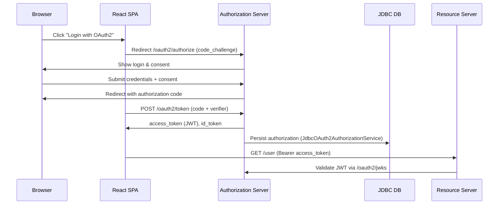

<!--
  oauth2-demo-architecture-and-workflow.md
  Purpose: Explain the architecture, wiring, and how to run the oauth2-demo module (Authorization Server + Resource Server + Client)
  Location: oauth2/oauth2-demo/docs/
-->

# oauth2-demo — Architecture and Workflow

Checklist

- Overview of the demo architecture and components
- How the Authorization Server, Resource Server, and Client are wired together
- How to run the demo locally (PowerShell commands included)
- How to exercise the Authorization Code + PKCE flow and inspect the H2 database
- Troubleshooting tips and next steps

1) Purpose

The `oauth2-demo` module is a minimal, self-contained Spring Boot application that runs an Authorization Server, a small Resource Server and an OAuth2 client in the same process. It uses an embedded H2 database to persist registered clients and authorizations (JDBC). The demo purpose is educational: to show how the project's modules can be configured and exercised end-to-end for the Authorization Code + PKCE flow.

2) High-level architecture

**Backend (Spring Boot on port `8085`):**
- OAuth2 Authorization Server endpoints (configured via Spring Authorization Server APIs)
  - Authorization endpoint: `/oauth2/authorize`
  - Token endpoint: `/oauth2/token`
  - JWK Set endpoint: `/oauth2/jwks`
  - H2 Console: `/h2-console` (for direct database inspection)
- OAuth2 Client (Spring Security OAuth2 Client) configured with a `ClientRegistration` pointing to the local Authorization Server
- Resource endpoints exposed by the demo controller: `/`, `/user`, `/admin`
- Database Viewer API endpoints:
  - `GET /db/clients` — list registered OAuth2 clients
  - `GET /db/authorizations` — list issued authorizations
  - `GET /db/consents` — list user consents
- Embedded H2 database (in-memory) initialized with Spring Authorization Server schemas for RegisteredClient, Authorization, Consent tables

**Frontend (React on port `3000`):**
- Standalone React SPA that communicates with the backend via HTTP
- Proxies API requests to `http://localhost:8085` (configured in `package.json`)
- Features:
  - OAuth2 Authorization Code flow with PKCE (automatic code challenge/verifier generation)
  - JWT token viewer with claim decoding
  - Protected resource access with Bearer token
  - Interactive database viewer (clients, authorizations, consents)

3) Key files (what I created)

**Backend (Spring Boot):**
- `build.gradle` — demo build configuration (Spring Boot + Authorization Server + OAuth2 client/resource-server + H2)
- `src/main/java/sample/oauth2/demo/OAuth2DemoApplication.java` — Spring Boot entry point
- `src/main/java/sample/oauth2/demo/config/AuthorizationServerConfig.java` — Authorization Server wiring (H2 DataSource, JDBC repos, JWK Source, ProviderSettings, RegisteredClient seed)
- `src/main/java/sample/oauth2/demo/config/SecurityConfig.java` — app security, `ClientRegistrationRepository`, `JwtDecoder`, in-memory users
- `src/main/java/sample/oauth2/demo/web/DemoController.java` — small endpoints to exercise auth
- `src/main/java/sample/oauth2/demo/web/DatabaseViewerController.java` — REST endpoints to view database tables (clients, authorizations, consents)
- `src/main/resources/application.properties` — demo properties (port + logging + H2 console)

**Frontend (React):**
- `frontend/` — standalone React application
- `frontend/package.json` — React dependencies
- `frontend/public/index.html` — HTML entry point
- `frontend/src/App.js` — main OAuth2 flow orchestration
- `frontend/src/components/AuthorizationFlow.js` — login initiation with PKCE support
- `frontend/src/components/TokenDisplay.js` — JWT token viewer and decoder
- `frontend/src/components/ProtectedResource.js` — Bearer token resource caller
- `frontend/src/components/DatabaseViewer.js` — database table viewer

4) Data model and persistence

- The demo uses an embedded H2 database created at startup and initialized from the Spring Authorization Server SQL scripts (registered client, authorization, consent tables).
- A sample `RegisteredClient` is inserted programmatically at startup (`clientId=demo-client`, `clientSecret=secret`) and stored in the DB via `JdbcRegisteredClientRepository`.

5) Runtime wiring details

- JWKSource: a temporary RSA key pair is generated at startup and exposed via `/oauth2/jwks` so JWT access/id tokens can be validated by resource servers and clients.
- ProviderSettings: issuer is `http://localhost:8085` (used in generated tokens and discovery metadata).
- Security filter chains: the Authorization Server filter chain is applied with `OAuth2AuthorizationServerConfigurer`; the application also uses a standard web security chain for form login and OAuth2 login.

6) How to run the demo

**Option 1: Backend only (Spring Boot)**

From the repository root, run:

```powershell
# From repository root
.\gradlew.bat :oauth2-demo:bootRun --no-daemon
```

Backend will be available at `http://localhost:8085`.

**Option 2: Backend + Frontend (recommended for full demo)**

**Terminal 1 - Backend (Spring Boot):**

```powershell
# From repository root
.\gradlew.bat :oauth2-demo:bootRun --no-daemon
# Backend runs on http://localhost:8085
```

**Terminal 2 - Frontend (React):**

```powershell
# Navigate to the frontend directory
cd oauth2/oauth2-demo/frontend

# Install dependencies (first time only)
npm install

# Start the React development server
npm start
# Frontend runs on http://localhost:3000
```

Open `http://localhost:3000` in your browser to access the full interactive demo with UI.

**Note:** If you prefer to run the backend in isolation without the root build constraints, a standalone Gradle wrapper is available in the `oauth2-demo` directory.

7) Testing Authorization Code + PKCE flow

**Using the React Frontend (recommended):**

1. Start both backend and frontend as described in section 6.

2. Open `http://localhost:3000` in your browser.

3. Click **"Login with OAuth2"** button.

4. You will be redirected to the Authorization Server's login page.

5. Login using demo credentials:
   - Username: `user`
   - Password: `password`

6. Approve the consent screen (the client requests authorization to access user info).

7. After successful authorization, you will be redirected back to the React app with:
   - An access token (JWT)
   - An ID token (JWT)
   - A refresh token

8. In the React UI you can:
   - **View Tokens**: Decode and inspect JWT claims in the "Tokens" tab
   - **Call Protected Resource**: Click to call `/user` endpoint with Bearer token authentication
   - **View Database**: Inspect registered clients, authorizations, and user consents in the "Database" tab

**Manual Testing (backend only):**

1. Open a browser and navigate to:

   http://localhost:8085/oauth2/authorization/demo-client

   This will start the OAuth2 login flow for the client registration `demo-client`.

2. Login using the demo user credentials:

   - Username: `user`
   - Password: `password`

3. Approve the consent request.

4. After successful login and exchange, you will be redirected back and a session will be established. Visit:

   - http://localhost:8085/user — should show a greeting with the principal name.

8) Inspect H2 database

**Option 1: React Frontend Database Viewer (recommended)**

The React UI includes an interactive "Database" tab that displays:
- Registered OAuth2 clients
- Issued authorizations
- User consents

Simply navigate to `http://localhost:3000` and click the "Database" tab.

**Option 2: H2 Web Console**

Access the H2 web console directly:

1. Open `http://localhost:8085/h2-console` in your browser
2. Use the default connection string: `jdbc:h2:mem:testdb`
3. Click "Connect"
4. Query the tables:
   - `oauth2_registered_client` — registered OAuth2 clients
   - `oauth2_authorization` — issued authorizations
   - `oauth2_authorization_consent` — user consents

**Option 3: REST API**

Query the database programmatically via the Database Viewer API:

```powershell
# Get registered clients
Invoke-WebRequest -Uri "http://localhost:8085/db/clients" | Select-Object -ExpandProperty Content

# Get authorizations
Invoke-WebRequest -Uri "http://localhost:8085/db/authorizations" | Select-Object -ExpandProperty Content

# Get consents
Invoke-WebRequest -Uri "http://localhost:8085/db/consents" | Select-Object -ExpandProperty Content
```

9) Troubleshooting

- If the application fails to start due to dependency resolution or version conflicts when running from the root build, run the demo in isolation (I can add a local wrapper) or align versions in `build.gradle` to match the repo.
- If login/redirect fails: check console logs for token exchange errors and ensure the RegisteredClient redirect URIs exactly match the client registration in `AuthorizationServerConfig`.
- If JWT verification fails on the client side, ensure the JWK Set is reachable at `http://localhost:8085/oauth2/jwks` and that the `jwkSetUri` in the `ClientRegistration` matches it.

10) Architecture enhancements (completed)

The following enhancements have been implemented:

✅ **H2 Console + Database Viewer**
- H2 web console enabled at `/h2-console` for direct database inspection
- Database Viewer REST API with endpoints for `/db/clients`, `/db/authorizations`, `/db/consents`
- Interactive database viewer in the React UI

✅ **Standalone Frontend Setup**
- Complete React SPA in `frontend/` directory
- Quick start: `cd frontend && npm install && npm start`
- React proxies API requests to backend at `http://localhost:8085`

✅ **Complete ReactJS Frontend**
- OAuth2 Authorization Code flow with PKCE support
- JWT token decoder with claim visualization
- Protected resource access with Bearer token authentication
- Database table viewer (clients, authorizations, consents)
- Responsive design with intuitive UI

11) Further enhancements and customizations

Possible future enhancements:
- Add client authentication methods (e.g., certificate-based auth) to the Authorization Server
- Implement token introspection and revocation endpoints
- Add scope management UI for consent screens
- Extend the database viewer with filtering and search capabilities
- Add OAuth2 authorization code flow tests in the test suite

For feature requests or questions, refer to the main Spring Security documentation and the Authorization Server reference implementation.


## Appendix A — Authorization Server bootstrap (implementation details)

This appendix documents how the OAuth2 Authorization Server is bootstrapped in the demo application and points to the exact wiring in the codebase.

Files to inspect
- `src/main/java/sample/oauth2/demo/config/AuthorizationServerConfig.java` — core Authorization Server wiring (DataSource, JDBC repositories, RegisteredClient seed, JWK generation, ProviderSettings, Authorization Server filter chain).
- `src/main/java/sample/oauth2/demo/config/SecurityConfig.java` — default web security, in-memory users, `ClientRegistrationRepository` for the demo client, and `JwtDecoder` configuration.

Key bootstrap steps and where they happen

1) DataSource & schema initialization
- Implemented in `AuthorizationServerConfig.dataSource()` — an embedded H2 database is created and the Spring Authorization Server SQL scripts are executed to create the required tables (registered clients, authorizations, authorization consents).

2) JdbcTemplate & JDBC repositories
- `AuthorizationServerConfig.jdbcTemplate()` creates a `JdbcTemplate` from the DataSource.
- `JdbcRegisteredClientRepository` is created and a sample `RegisteredClient` (the demo client) is saved at startup in `AuthorizationServerConfig.registeredClientRepository(...)`.
- `JdbcOAuth2AuthorizationService` and `JdbcOAuth2AuthorizationConsentService` are wired to persist runtime authorizations and consents.

3) RegisteredClient seed (demo client)
- The demo creates and persists a `RegisteredClient` with these properties: `clientId="demo-client"`, `clientSecret="secret"` (encoded via the configured `PasswordEncoder`), grant types `authorization_code` and `refresh_token`, redirect URIs `http://localhost:8085/login/oauth2/code/demo-client` and `http://localhost:8085/authorized`, scopes `openid` and `profile`, and `requireAuthorizationConsent=true`.

4) JWK generation and exposure
- `AuthorizationServerConfig.jwkSource()` generates an RSA key pair (2048 bits) at startup, builds a Nimbus `RSAKey` and `JWKSet`, and exposes a `JWKSource<SecurityContext>` used by the Authorization Server to serve `/oauth2/jwks`. Tokens issued by the server are signed with this key.

5) Provider settings (issuer)
- `AuthorizationServerConfig.providerSettings()` sets the issuer to `http://localhost:8085`. The issuer value is used in generated tokens and discovery metadata.

6) Security filter chains
- The Authorization Server installs a dedicated `SecurityFilterChain` via `authorizationServerSecurityFilterChain(HttpSecurity)` annotated with `@Order(Ordered.HIGHEST_PRECEDENCE)`. It applies `OAuth2AuthorizationServerConfigurer` to register the standard Authorization Server endpoints (`/oauth2/authorize`, `/oauth2/token`, `/oauth2/jwks`, discovery metadata, etc.).
- The default application `SecurityFilterChain` is declared in `SecurityConfig.defaultSecurityFilterChain(...)` and permits public access to `/oauth2/**`, `/.well-known/**`, `/h2-console/**` and the demo `/db/**` endpoints; it also enables form login and `oauth2Login` for the client/UI.

7) Users, client registration (client side) and token validation
- In-memory users (username `user`, password `password`; username `admin`, password `admin`) are declared in `SecurityConfig.users(...)` for interactive logins.
- To allow the application to act as an OAuth2 client against the local Authorization Server, an in-memory `ClientRegistrationRepository` is configured in `SecurityConfig.clientRegistrationRepository()` with a matching registration for `demo-client` and the appropriate `authorizationUri`, `tokenUri`, and `jwkSetUri` pointing to the local server.
- `SecurityConfig.jwtDecoder()` creates a `NimbusJwtDecoder` that uses the server's `jwkSetUri` (`http://localhost:8085/oauth2/jwks`) to validate JWTs issued by the demo Authorization Server.

Bootstrap (startup) sequence (conceptual)

1. Spring Boot starts and configuration classes are initialized.
2. `dataSource()` creates the embedded H2 DB and runs the Authorization Server schema SQL scripts.
3. `jdbcTemplate()` is created and used to initialize JDBC-backed repositories.
4. `registeredClientRepository()` constructs and saves the demo `RegisteredClient` into the JDBC repository.
5. `authorizationService()` and `authorizationConsentService()` are wired to use the `JdbcTemplate` and `RegisteredClientRepository`.
6. `jwkSource()` generates the RSA keypair and makes the JWKSet available to the server.
7. `providerSettings()` sets the issuer and discovery metadata.
8. The Authorization Server security filter chain is registered (highest precedence) and registers the `/oauth2/*` endpoints.
9. The default security chain, user details, client registration, and `JwtDecoder` are created.
10. The server becomes available at `http://localhost:8085` with working Authorization Server endpoints and the H2 console at `/h2-console`.

Useful pointers and values
- Demo RegisteredClient values: `clientId=demo-client`, `clientSecret=secret`, scopes `openid,profile`, redirect URIs include `http://localhost:8085/login/oauth2/code/demo-client`.
- JWKSet URI: `http://localhost:8085/oauth2/jwks`
- H2 console URL: `http://localhost:8085/h2-console` (default JDBC URL `jdbc:h2:mem:testdb`)

Where to look in the code (quick links)
- `oauth2-demo/src/main/java/sample/oauth2/demo/config/AuthorizationServerConfig.java` (DataSource, RegisteredClient seed, JWKSource, ProviderSettings, AuthorizationServerSecurityFilterChain)
- `oauth2-demo/src/main/java/sample/oauth2/demo/config/SecurityConfig.java` (default security chain, users, ClientRegistrationRepository, JwtDecoder)
- `oauth2-demo/src/main/java/sample/oauth2/demo/OAuth2DemoApplication.java` (Spring Boot entry point)

If you'd like, I can add inline comments in the source files that call out these bootstrap steps, or create a small architecture diagram (SVG/PNG) and embed it in this docs page.

Sequence diagram (request flow)

Mermaid (if supported by your renderer):



SVG image (embedded):

<!-- Try rendering the SVG via an <object> tag first; some Markdown renderers will fall back to the inline SVG below if object embedding is blocked -->
<object data="./oauth2-demo-sequence.svg" type="image/svg+xml" aria-label="OAuth2 Demo sequence diagram">Your browser does not support embedded SVG. The inline SVG fallback follows.</object>

<!-- Inline SVG fallback: some renderers (and some static site generators) sanitize or block remote SVG image rendering. Embedding the SVG inline increases the chance it displays correctly in environments that allow raw SVG markup in Markdown. If this still doesn't render, your renderer likely sanitizes SVG — consider exporting a PNG and embedding that instead. -->

<svg width="1000" height="420" viewBox="0 0 1000 420" xmlns="http://www.w3.org/2000/svg">
  <defs>
    <marker id="arrow" markerWidth="10" markerHeight="7" refX="10" refY="3.5" orient="auto">
      <polygon points="0 0, 10 3.5, 0 7" fill="#333" />
    </marker>
    <style>
      /* note: rx is an attribute on rect elements, not a CSS property */
      .box { fill: #f7fbff; stroke: #2b6cb0; stroke-width: 2; }
      .title { font: 14px 'Segoe UI', Roboto, Arial; fill: #0b3d91; font-weight: 700; }
      .label { font: 12px 'Segoe UI', Roboto, Arial; fill: #102a43; }
      .lane { stroke: #cbd5e1; stroke-width: 1; }
      .note { font: 11px 'Segoe UI', Roboto, Arial; fill: #1f2937; }
    </style>
  </defs>

  <!-- Lanes -->
  <line x1="200" y1="40" x2="200" y2="380" class="lane" />
  <line x1="430" y1="40" x2="430" y2="380" class="lane" />
  <line x1="660" y1="40" x2="660" y2="380" class="lane" />

  <!-- Participants -->
  <g transform="translate(20,20)">
    <rect class="box" x="0" y="10" width="160" height="40" rx="6" />
    <text x="80" y="35" class="title" text-anchor="middle">Browser</text>
    <text x="80" y="52" class="label" text-anchor="middle">User agent</text>
  </g>

  <g transform="translate(230,20)">
    <rect class="box" x="0" y="10" width="180" height="40" rx="6" />
    <text x="90" y="35" class="title" text-anchor="middle">React SPA</text>
    <text x="90" y="52" class="label" text-anchor="middle">Client (PKCE)</text>
  </g>

  <g transform="translate(460,20)">
    <rect class="box" x="0" y="10" width="180" height="40" rx="6" />
    <text x="90" y="35" class="title" text-anchor="middle">Authorization Server</text>
    <text x="90" y="52" class="label" text-anchor="middle">/oauth2/* endpoints</text>
  </g>

  <g transform="translate(690,20)">
    <rect class="box" x="0" y="10" width="200" height="40" rx="6" />
    <text x="100" y="35" class="title" text-anchor="middle">JDBC DB</text>
    <text x="100" y="52" class="label" text-anchor="middle">H2: registered_client, authorization</text>
  </g>

  <g transform="translate(230,120)">
    <rect class="box" x="0" y="10" width="420" height="40" rx="6" />
    <text x="210" y="35" class="title" text-anchor="middle">Resource Server / App</text>
    <text x="210" y="52" class="label" text-anchor="middle">/user (validates JWT with JWKs)</text>
  </g>

  <!-- Arrows & labels -->
  <g stroke="#333" stroke-width="2" fill="none" marker-end="url(#arrow)">
    <!-- Browser -> React SPA -->
    <line x1="90" y1="60" x2="230" y2="60" />
    <text x="160" y="50" class="note" text-anchor="middle">click "Login with OAuth2"</text>

    <!-- React SPA -> Authorization Server (authorize request with PKCE) -->
    <line x1="410" y1="60" x2="460" y2="60" />
    <line x1="410" y1="60" x2="460" y2="60" marker-end="url(#arrow)" />
    <text x="435" y="50" class="note" text-anchor="middle">Redirect /oauth2/authorize (code_challenge)</text>

    <!-- Authorization Server -> Browser (login form) -->
    <line x1="540" y1="90" x2="110" y2="120" marker-end="url(#arrow)" />
    <text x="325" y="95" class="note" text-anchor="middle">Show login & consent</text>

    <!-- Browser -> Authorization Server (submit credentials -> consent approve) -->
    <line x1="110" y1="140" x2="540" y2="140" marker-end="url(#arrow)" />
    <text x="325" y="130" class="note" text-anchor="middle">POST credentials / consent</text>

    <!-- Authorization Server -> Browser (redirect with code) -->
    <line x1="640" y1="160" x2="230" y2="160" marker-end="url(#arrow)" />
    <text x="435" y="150" class="note" text-anchor="middle">302 Redirect with authorization code</text>

    <!-- React SPA -> Authorization Server (token exchange with PKCE verifier) -->
    <line x1="410" y1="190" x2="460" y2="190" marker-end="url(#arrow)" />
    <text x="435" y="180" class="note" text-anchor="middle">POST /oauth2/token (code + verifier)</text>

    <!-- Authorization Server -> React SPA (tokens) -->
    <line x1="640" y1="190" x2="410" y2="190" marker-end="url(#arrow)" />
    <text x="525" y="180" class="note" text-anchor="middle">Return access_token (JWT), id_token</text>

    <!-- Authorization Server -> JDBC DB (persist authorization) -->
    <line x1="630" y1="210" x2="790" y2="240" marker-end="url(#arrow)" />
    <text x="710" y="210" class="note" text-anchor="middle">Persist authorization (JdbcOAuth2AuthorizationService)</text>

    <!-- React SPA -> Resource Server (/user) -->
    <line x1="440" y1="240" x2="440" y2="300" marker-end="url(#arrow)" />
    <text x="380" y="270" class="note" text-anchor="middle">GET /user (Bearer access_token)</text>

    <!-- Resource Server -> JWKs (validate token) -->
    <line x1="520" y1="300" x2="740" y2="140" marker-end="url(#arrow)" />
    <text x="650" y="270" class="note" text-anchor="middle">Validate JWT with /oauth2/jwks</text>
  </g>

  <!-- Footer note -->
  <text x="20" y="400" class="label">Generated sequence diagram: Authorization Code + PKCE flow, token issuance and DB persistence.</text>
</svg>

